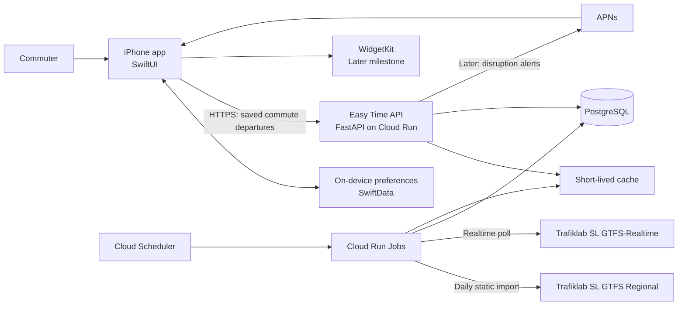

# Easy Time architecture

## System overview



## Responsibilities

### iPhone app

- Lets a person create, edit, and switch between saved commutes.
- Stores chosen stop, platform, line, direction, and walking buffer locally.
- Requests a concise departures response from the backend.
- Renders scheduled time, real-time time, delay, accessibility-friendly status,
  and an empty/error state.
- Does not contain Trafiklab credentials or parse GTFS files.

### Backend API

- Exposes a narrow authenticated or rate-limited API for saved-commute
  departures.
- Resolves a saved direction to its relevant stop-times and real-time updates.
- Caches short-lived answers to keep the interface responsive and reduce
  transport-provider requests.
- Normalizes provider data so the iOS app is insulated from GTFS details.

### Data ingestion

- Downloads the SL GTFS static feed daily.
- Polls the matching GTFS-Realtime feeds frequently.
- Validates, transforms, and stores only the data required for departure lookup.
- Records the freshness of every real-time update so the app can disclose stale
  data instead of implying it is live.

## Core data model

```text
SavedCommute
  id, name, icon
  outboundDirectionId
  returnDirectionId

CommuteDirection
  boardingStopId, platformId?
  allowedRouteIds[]
  destinationLabel
  walkingBufferMinutes

Departure
  tripId, routeId, stopId
  scheduledAt, predictedAt?
  status, dataFreshnessAt
```

## API shape: initial proposal

```http
GET /v1/departures?stop_id={stopId}&route_id={routeId}&direction={direction}
```

```json
{
  "generated_at": "2026-08-28T08:10:00Z",
  "freshness_at": "2026-08-28T08:09:45Z",
  "departures": [
    {
      "route": "43",
      "destination": "Hökarängen",
      "scheduled_at": "2026-08-28T08:18:00Z",
      "predicted_at": "2026-08-28T08:21:00Z",
      "status": "delayed"
    }
  ]
}
```

## Privacy and reliability

- The MVP must work with manually selected stops and no location permission.
- If nearby-stop suggestions are added, request location only while the app is
  in use and provide a manual fallback.
- Store only the minimum user preferences required for saved commutes.
- Never send an API key to the client or commit it to the repository.
- Show when real-time data is stale, unavailable, or replaced by the schedule.

